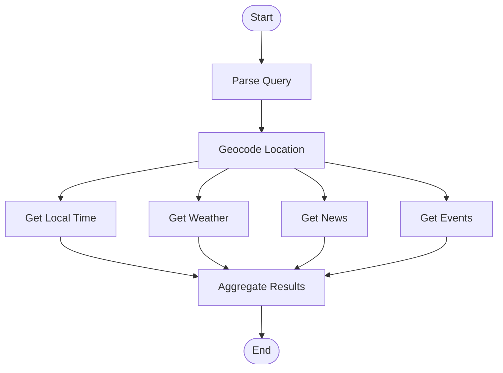

## Destination Compass - Project Plan Template

This plan is based on a LangGraph-style design specification for the "Destination Compass Chatbot",modeled on the principles and workflow from the referenced documentation

### 1) Problem and Outcomes
- **Use case**: Destination Planning chatbot that provides local information
- **Success criteria**: The chatbot provides weather info, local time, local news and upcoming local events or activities for the specified location
- **Inputs**: The user asks for a daily local roundup for "Goa, India." 
- **Outputs**: The output shows today's weather, time, top news and events for Goa, India. 
- **Constraints**: <latency, cost, compliance>
- **Tools**: 
    - Weather API (e.g., OpenWeatherMap)
    - World clock/time API (e.g., TimeZoneDB)
    - News aggregator API (e.g., Bing News, NewsAPI)
    - Events API (e.g., Eventbrite, Ticketmaster, Meetup)

### System Overview
A modular multi-agent system to provide city-specific weather, time, news, and local event information. Agents coordinate using LangGraph, passing data and requests efficiently for context-aware responses.

### Agents and Roles
**Agent**|**Tool/API Used**|**Inputs**|**Outputs**
-----|-----|-----|-----
Location Extractor|Geocoding API (Google Maps)|Raw user query|Structured location data
Weather Agent|OpenWeatherMap API|Location data|Weather summary
Local Time Agent|TimeZoneDB API|Location data|Current local time
News Agent|NewsAPI, Bing News|Location/Time|Top local news headlines
Events Agent|Eventbrite/Meetup API|Location, Weather, Time|Filtered local events/activities

### Sample Workflow Illustration
User query: “What’s happening tonight in Goa?”

Location Extraction agent determines “Goa, India” and passes city to all other agents.

Local Time Agent returns the local time (e.g., it’s 7 PM IST).

Events Agent uses this info to filter for events starting “after 7 PM.”

Weather Agent confirms if outdoor events are suitable.

News Agent shares relevant headlines to provide context on any major local happenings.


### 2) Discrete Steps (Nodes & Edges)

- **Nodes**:
    - User Query Ingestion
    - Location Extraction
    - Weather Retrieval
    - Time Retrieval
    - News Retrieval
    - Events Retrieval
    - Output Aggregation

- **Edges**:
    - User Query → Location Extraction Node
    - Location Extraction Node → All Data Retrieval Nodes (parallel edges)
    - Weather/Time Nodes → Events Retrieval Node (informing event selection)
    - News Node → Events Node (optional, for context)
    - All Retrieval Nodes → Aggregation Node

Add/remove nodes as needed. Keep external API calls isolated for retries and observability.

### 3) Node Specifications

- **Nodes** 
  - **Parse Query**: Extracts location and context from the user’s input.
  - **Geocode Location**: Converts the location string into structured geographic data.
  - **Get Local Time**: Looks up timezone and current time for the location.
  - **Get Weather**: Retrieves weather data for the city.
  - **Get News**: Summarizes top local headlines.
  - **Get Events**: Finds upcoming local events, optionally adjusts recommendations based on weather.
  - **Aggregate Results**: Formats all collected info for user output.

- **Workflow Path Example** 
```
User Query → Parse Query → Geocode Location → [in parallel: Get Local Time, Get Weather, Get News, Get Events] → Aggregate Results
```

Define inputs, context, and outputs for each node.

**Node**|**Type**|**Context (Inputs)**|**Output**
:-----:|:-----:|:-----:|:-----:
Parse Query|LLM|User query|Location string
Geocode Location|Data|Location string|Structured location
Get Local Time|Data|Structured location|Local time info
Get Weather|Data|Structured location|Weather summary
Get News|Data|Structured location and current time|Top headlines
Get Events|Data/LLM|Structured location, weather, time|Event list
Aggregate Results|Action|All above|Final formatted output


### 4) Shared State Design
The state is shared, raw, and unformatted. Each node reads/writes data it needs.

- **Raw inputs**: `<input_text>`, `<sender/user_id>`, `<request_id>`
- **Derived/expensive results**: `<classification>`, `<search_results>`, `<customer_data>`
- **Generated artifacts**: `<draft_output>`, `<messages/logs>`
- **Execution metadata**: `<timestamps>`, `<retries>`, `<trace/ids>`

Sketch a TypedDict-like schema:

```python
class DestinationCompassState(TypedDict):
    user_query: str
    location_string: str | None
    structured_location: dict | None
    local_time: str | None
    weather: dict | None
    news_headlines: list[str] | None
    events: list[dict] | None
    final_output: str | None
    messages: list[str] | None
```



### 5) Error Handling Strategy
Map error classes to handling.

- **Transient (network/rate)**: automatic retry with backoff on Data/Action nodes
- **LLM-recoverable (formatting/ambiguity)**: re-prompt or loop with guardrails
- **User-fixable (missing info/approval)**: `interrupt()` and resume with human input
- **Unexpected**: surface error; rely on checkpoints for recovery

### 6) Node Implementation Checklist
- [ ] Implement `read_input`
- [ ] Implement `classify_intent` (returns routing + structured result)
- [ ] Implement `search_knowledge` (with retry policy)
- [ ] Implement `create_ticket` (returns ticket id)
- [ ] Implement `draft_output` (tone/policy guardrails)
- [ ] Implement `human_review` (interrupt first; process approval)
- [ ] Implement `send_output` (idempotent + retries)

### 7) Wiring the Graph
- **Edges**: minimal explicit edges; routing via Command inside nodes
  - `START -> read_input`
  - `read_input -> classify_intent`
  - `send_output -> END`
- **Checkpointer**: <memory/durable store as needed>
- **Retry policies**: attach to nodes calling external services

### 8) Configuration and Persistence
- **Thread/session key**: `<thread_id>` to group runs
- **Checkpoint mode**: `<async | sync | exit>`
- **Secrets/config**: <env vars, providers>
- **Observability**: <logs, tracing, evals>

### 9) Test Plan
- **Happy paths**: <simple Q&A, standard action>
- **Branches**: <bug/feature/billing/etc.>
- **Human-in-the-loop**: verify pause/resume via `interrupt()`
- **Failure cases**: simulate network errors, invalid LLM output, retries
- **Determinism**: seed/test prompts where feasible

### 10) Rollout Considerations
- **Safety/guardrails**: <policy checks>
- **Limits**: <rate/cost budgets>
- **Backpressure**: <queueing/batching>
- **Fallbacks**: <graceful degradation>

### References
- Thinking in LangGraph (planning approach and patterns): [docs](https://docs.langchain.com/oss/python/langgraph/thinking-in-langgraph)


