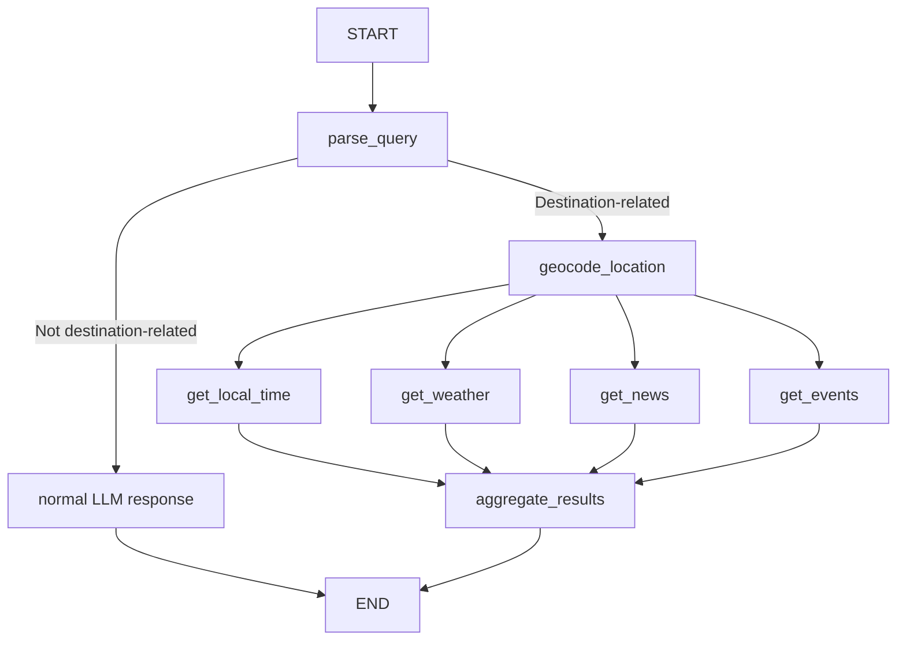

# Destination Compass 🌍

A comprehensive destination information chatbot that provides real-time weather, news, events, and local time for any location worldwide. Built with LangGraph for workflow orchestration and multiple APIs for data collection.

## Features

- 🌍 **Location Intelligence**: Automatically extracts and geocodes locations from natural language queries
- 🌤️ **Real-time Weather**: Current weather conditions with temperature, humidity, and forecasts
- 📰 **Local News**: Recent headlines and news relevant to the destination
- 🎉 **Events Discovery**: Upcoming local events and activities
- 🕐 **Timezone Awareness**: Accurate local time for any location
- 💬 **Interactive Chat**: Simple Gradio chat interface
- 🧭 **Smart Intent Handling**: Non-destination queries are answered directly without running the full pipeline
- 📊 **Observability**: Optional LangSmith tracing for debugging and monitoring

## Author
**Author:** Sachin Ambe

**Date:** October 29, 2025

**Description:** This project is part of the ReadyTensor AAIDC (Agentic AI Developer Certification) curriculum, designed as a multi-agent system using LangGraph as the orchestration framework.

## Quick Start

### 1. Clone and Install

```bash
git clone <repository-url>
cd rt-aaidc-project2
pip install -r requirements.txt
```

### 2. Set Up Environment Variables

Copy the example environment file and fill in your API keys:

```bash
cp env.example .env
```

Edit `.env` with your actual API keys:

```bash
# Required API Keys
GROQ_API_KEY=your_groq_api_key_here
NEWS_API_KEY=your_news_api_key_here
OPENWEATHER_API_KEY=your_openweather_api_key_here
TAVILY_API_KEY=your_tavily_api_key_here

# Optional
LANGSMITH_API_KEY=your_langsmith_api_key_here
LANGSMITH_TRACING=false
```

### 3. Run the Application

```bash
python src/app.py
```

The Gradio interface will open in your browser at `http://localhost:7860`.

## API Keys Required

### Required (Free Tiers Available)

| Service | Purpose | Free Tier | Get Key |
|---------|---------|-----------|---------|
| **Groq** | LLM for location extraction and report generation | 14,400 requests/day | [console.groq.com](https://console.groq.com/keys) |
| **NewsAPI** | News headlines | 1,000 requests/day | [newsapi.org](https://newsapi.org/register) |
| **OpenWeatherMap** | Weather data | 1,000 requests/day | [openweathermap.org](https://openweathermap.org/api) |
| **Tavily** | Event search | 1,000 requests/month | [tavily.com](https://tavily.com/) |

### Optional

| Service | Purpose | Free Tier | Get Key |
|---------|---------|-----------|---------|
| **LangSmith** | Tracing and monitoring | 1,000 traces/month | [smith.langchain.com](https://smith.langchain.com/) |

## Usage Examples

### Basic Queries
- "What's the weather like in Paris?"
- "Tell me about events in New York this week"
- "Get me information about Tokyo"
- "What's happening in London today?"

### Advanced Queries
- "I'm planning a trip to Barcelona, what should I know?"
- "What's the weather and events in San Francisco this weekend?"
- "Give me a complete overview of Dubai"

## Architecture

### LangGraph Workflow



### Technology Stack

- **LangGraph**: Workflow orchestration and state management
- **Groq**: Fast LLM inference for location extraction, intent classification, report generation, and general chat
- **Gradio**: Simple interactive web interface
- **OpenStreetMap**: Free geocoding service
- **Multiple APIs**: Weather, news, and events data
- **LangSmith**: Optional tracing and observability

## Configuration

The application uses a YAML-based configuration system. Edit `config.yaml` to customize:

- API endpoints and timeouts
- LLM model settings and temperatures
- Content limits and processing patterns
- Error messages and default values
- Gradio interface settings

## Development

### Project Structure

```
rt-aaidc-project2/
├── src/
│   ├── models/                   # Data models and state
│   │   ├── __init__.py
│   │   └── state.py
│   ├── services/                 # External API services
│   │   ├── __init__.py
│   │   ├── geocoding.py
│   │   ├── weather.py
│   │   ├── news.py
│   │   ├── events.py
│   │   ├── time.py
│   │   └── llm.py
│   ├── nodes/                    # LangGraph workflow nodes
│   │   ├── __init__.py
│   │   ├── location_nodes.py
│   │   ├── data_nodes.py
│   │   └── aggregation_nodes.py
│   ├── ui/                       # User interface components
│   │   ├── __init__.py
│   │   └── gradio_interface.py
│   ├── app.py                    # Main application
│   ├── config_loader.py          # Configuration management
│   └── destination_compass.py    # Legacy file (deprecated)
├── config.yaml                   # Configuration file
├── requirements.txt              # Python dependencies
├── MIGRATION.md                  # Migration guide
└── README.md                    # This file
```

### Adding New Data Sources

1. Add API configuration to `config.yaml`
2. Create a new service class in `src/services/`
3. Create a node in `src/nodes/` if needed
4. Update the workflow in `src/app.py`

### Enabling LangSmith Tracing

1. Get API key from [LangSmith](https://smith.langchain.com/)
2. Set `LANGSMITH_API_KEY` in your `.env` file
3. Set `LANGSMITH_TRACING=true` in your `.env` file
4. View traces in the LangSmith dashboard

## Troubleshooting

### Common Issues

1. **"API key not configured"**
   - Check that all required API keys are set in `.env`
   - Verify the API keys are valid and active

2. **"No location data"**
   - Ensure the location query is clear and specific
   - Check that the geocoding service is accessible

3. **"Events temporarily unavailable"**
   - Verify Tavily API key is correct
   - Check API rate limits

4. **Gradio interface not loading**
   - Ensure port 7860 is available
   - Check for firewall restrictions

### Debug Mode

Enable debug logging:

```bash
export LANGCHAIN_VERBOSE=true
python src/app.py
```

## Contributing

1. Fork the repository
2. Create a feature branch
3. Make your changes
4. Test thoroughly
5. Submit a pull request

## License

This project is licensed under the MIT License - see the [LICENSE](LICENSE) file for details.

## Acknowledgments

- [LangGraph](https://github.com/langchain-ai/langgraph) for workflow orchestration
- [Gradio](https://gradio.app/) for the beautiful interface
- [Groq](https://groq.com/) for fast LLM inference
- All the API providers for their free tiers